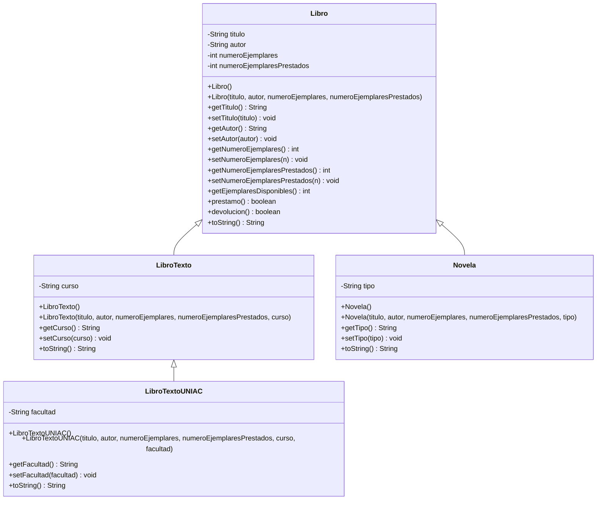

# Parcial I - Programación II - G411
## Sistema de gestión de biblioteca (POO: Abstracción, Encapsulamiento y Herencia)

Proyecto Maven muy simple, sin librerías externas (solo lo básico del JDK: `Scanner` para leer datos por consola).

---

## 1. Estructura del proyecto

```
biblioteca-parcial/
├── pom.xml
├── .gitignore
├── README.md
└── src/main/java/com/biblioteca/
    ├── Libro.java
    ├── LibroTexto.java
    ├── LibroTextoUNIAC.java
    ├── Novela.java
    └── Main.java
```

---

## 2. Diagrama UML de clases (0.5)



(GitHub renderiza este diagrama automáticamente al ver el README en el repositorio).

---

## 3. Algoritmo en Java (0.5)

El código completo y funcional está en `src/main/java/com/biblioteca/`:

- **Libro.java**: clase base con encapsulamiento (atributos `private`, métodos `get`/`set`), constructor vacío, constructor con parámetros, `prestamo()`, `devolucion()` y `toString()`.
- **LibroTexto.java**: hereda de `Libro`, agrega el atributo `curso`.
- **LibroTextoUNIAC.java**: hereda de `LibroTexto` (herencia de dos niveles), agrega el atributo `facultad`.
- **Novela.java**: hereda de `Libro`, agrega el atributo `tipo` (historica, romantica, policiaca, realista, cienciaFiccion, aventuras).
- **Main.java**: crea los 4 objetos pedidos y prueba los métodos `prestamo()` y `devolucion()`.

### Cómo ejecutarlo

```bash
mvn compile
mvn exec:java
```

o generando el `.jar`:

```bash
mvn package
java -jar target/parcial-biblioteca.jar
```

---

## 4. Los 4 objetos construidos (1.0)

En `Main.java`:

1. **libro1**: creado con el constructor con parámetros.
2. **libro2**: creado con el constructor vacío y luego se piden sus datos por consola con `Scanner`.
3. **libroTextoUNIAC**: creado con todos sus atributos (título, autor, ejemplares, prestados, curso y facultad).
4. **novela**: creada indicando su tipo (por ejemplo `"policiaca"`).

Luego se prueban `prestamo()` y `devolucion()` sobre varios de estos objetos, mostrando el resultado (`true`/`false`) y el estado del libro antes y después.

---

## 5. Dos situaciones donde NO se podría realizar la herencia (0.5)

### Situación 1: Clase declarada como `final`

Si la clase `Libro` se declarara como `final`, ninguna otra clase podría extenderla, y `LibroTexto extends Libro` produciría un **error de compilación**.

```java
// Fragmento hipotético - esto ROMPERÍA la herencia:
public final class Libro {
    // ...
}

// Esto ya NO compilaría:
public class LibroTexto extends Libro {
    // Error: cannot inherit from final Libro
}
```

En nuestro código real, `Libro` **no** es `final`, por eso `LibroTexto`, y a través de ella `LibroTextoUNIAC`, sí pueden heredar correctamente.

### Situación 2: Atributos `private` sin métodos `get`/`set`

Los atributos de `Libro` (`titulo`, `autor`, `numeroEjemplares`, `numeroEjemplaresPrestados`) son `private`. Esto es correcto para el **encapsulamiento**, pero si no existieran los métodos `get`/`set` públicos, una subclase como `LibroTexto` **no podría acceder ni modificar esos atributos**, ni siquiera heredando de `Libro`.

```java
// Fragmento real de Libro.java:
private String titulo; // private: no es visible directamente en LibroTexto

// Si NO existiera getTitulo()/setTitulo(), esto en LibroTexto.java fallaría:
public String resumen() {
    return titulo; // Error: titulo no es visible desde la subclase
}
```

Por eso en nuestro código sí se definieron los `get`/`set` públicos en `Libro`: son los que le permiten a `LibroTexto`, `LibroTextoUNIAC` y `Novela` trabajar con esos datos (por ejemplo usando `getTitulo()` dentro de sus propios `toString()`).

*(Otras situaciones posibles, no usadas aquí pero válidas para mencionar: constructores `private`, métodos `final` que no se pueden sobrescribir, o clases con modificador de paquete que impide heredar desde otro paquete).*

---

## 6. Dos nuevos atributos y un método adicional (0.5)

**Nuevos atributos propuestos para la clase `Libro`:**

1. **`isbn`** (`String`): código único internacional que identifica cada libro, útil para búsquedas exactas y para evitar libros duplicados.
2. **`anioPublicacion`** (`int`): año en que se publicó el libro, útil para ordenar el catálogo o filtrar libros por antigüedad.

**Nuevo método propuesto:**

- **`estaDisponible()`**: método que retorna `boolean` e indica rápidamente si el libro tiene al menos un ejemplar disponible para prestar, sin necesidad de calcular manualmente `getNumeroEjemplares() - getNumeroEjemplaresPrestados()` cada vez.

```java
public boolean estaDisponible() {
    return getEjemplaresDisponibles() > 0;
}
```

Este método tiene sentido porque se usaría, por ejemplo, antes de intentar hacer un préstamo, para mostrarle al usuario si vale la pena intentarlo.
